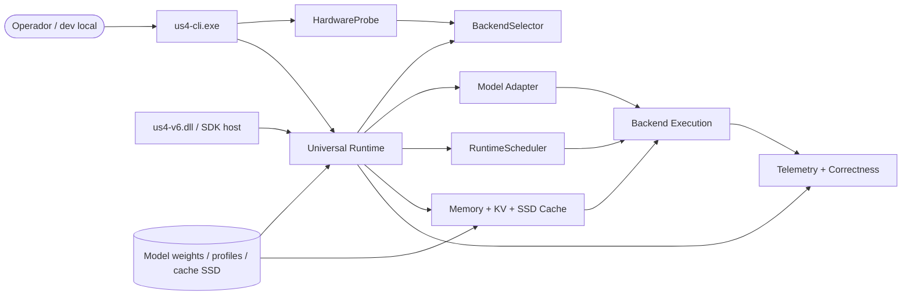
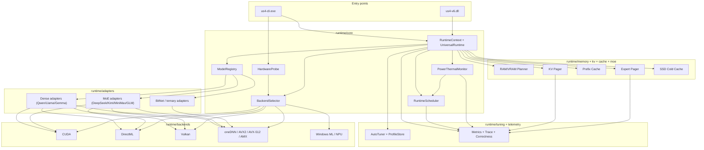

# Design — US4 V6 Windows Edition

> Visão geral da arquitetura alvo do runtime. Documento vivo. Decisões irreversíveis entram em ADR quando deixarem de ser hipótese.
> Audiência: time us4-core, revisores técnicos e agents AI que precisam entender os boundaries do sistema antes de editar código.

---

## 1. Contexto de sistema

`US4 V6 Windows Edition` é um runtime local de inferência para Windows x86-64. Ele expõe uma superfície principal de CLI, uma superfície opcional de SDK/dll e orquestra execução entre adapters especializados e backends heterogêneos.

Notas:
- `cli` é a entrada canônica para probe, benchmark, execução e autotune.
- `HardwareProbe` e `BackendSelector` definem backend e modo padrão; não é responsabilidade do adapter adivinhar hardware.
- `Universal Runtime` preserva o contrato comum entre famílias de modelos; especialização fica nos adapters.
- `Memory + KV + SSD Cache` existe para reduzir pressão de VRAM/RAM sem sacrificar correctness.

---

## 2. Componentes principais

Princípio: dependências de política ficam no core; dependências de dispositivo ficam nos backends; dependências de arquitetura de modelo ficam nos adapters. Sinais dinâmicos de power/thermal entram no core por um monitor dedicado, não por telemetria ad-hoc em backend ou adapter.

---

## 3. Boundaries

| Boundary | Responsabilidade | Regra |
|---|---|---|
| `Entry` | Parse de CLI, flags, paths, benchmark mode, probe mode | Não implementa lógica de geração. Traduz input em config tipada. |
| `Core` | Escolha de adapter, backend, modo, scheduler e downgrade dinâmico por budget | Conhece contratos, não conhece detalhes de kernel. |
| `Adapters` | Traduz família de modelo para planos de memória, layout de KV, quantização e execução | Não escolhe hardware; adapta arquitetura do modelo ao runtime. |
| `Memory/KV/Cache` | Planejamento de tiers VRAM/RAM/SSD, paginação, prefix reuse, expert reuse | Não muda logits; otimiza armazenamento e movimentação. |
| `Backends` | Execução concreta em CUDA, DirectML, Vulkan, CPU ou NPU | Sempre expõem fallback seguro e métricas de uso. |
| `Ops` | Autotune, traces, benchmark, correctness, drift | Telemetria observa sinais e efeitos; não decide downgrade sozinha. |

Cruzar boundary errado é smell. Exemplo: backend consultando flags cruas de CLI ou adapter alocando SSD diretamente.

---

## 4. Stack real

| Camada | Tecnologia |
|---|---|
| Linguagem principal | C++17/20 |
| Build system | CMake >= 3.27 + Ninja |
| Backends GPU | CUDA, DirectML, Vulkan compute |
| Backends CPU | oneDNN + AVX2 / AVX-512 / AMX + scalar fallback |
| Backends NPU | Windows ML, opt-in |
| Testes unitários | GoogleTest + CTest |
| Benchmarks | Google Benchmark |
| E2E | Playwright CLI |
| Qualidade | clang-format + clang-tidy |
| CI | GitHub Actions (`ci.yml`, `dod.yml`) |
| Distribuição | MSIX assinado + portable zip |

Mudança de stack, provider ou boundary precisa de ADR quando afetar mais de um componente.

---

## 5. Decisões arquiteturais vigentes

Ainda não há `ADR-*.md` materializadas além do template, mas estas decisões já são tratadas como contrato de projeto:

- Universal core com adapters especializados; o runtime não vira wrapper genérico sem opinião.
- Seleção de backend orientada por hardware: NVIDIA prioriza CUDA; AMD/Intel priorizam DirectML; Vulkan é fallback cross-vendor; CPU sempre existe.
- Correctness tem precedência sobre throughput. Toda otimização pode ser desligada e comparada com baseline.
- `KV cache` e `expert weights` podem ser tiered entre VRAM, RAM e SSD, mas decode quente não pode depender de SSD por token.
- Toda feature de adapter precisa de caminho funcional equivalente em DirectML, Vulkan ou CPU, salvo ADR explícito.

Quando qualquer uma dessas decisões mudar, abrir ADR em `./ADR-XXX-*.md` antes de propagar a mudança.

---

## 6. Fluxo de execução típico

1. `us4-cli.exe run --model ... --prompt ...` parseia flags e monta `RuntimeConfig`.
2. `HardwareProbe` detecta CPU features, RAM, GPU vendor, VRAM, suporte a CUDA, D3D12, Vulkan e Windows ML.
3. `BackendSelector` escolhe backend primário, cadeia de fallback e `RuntimeMode`.
4. `ModelRegistry` resolve a família do modelo e instancia o adapter correto.
5. Adapter constrói `MemoryPlan`, `KVLayout` e `QuantStrategy` compatíveis com hardware e modo.
6. Runtime inicializa backend, pools de memória, prefix cache e pagers necessários.
7. `RuntimeScheduler` executa prefill e decode, opcionalmente com batching contínuo e speculative decoding.
8. Telemetria coleta TTFT, tokens/s, uso de VRAM/RAM, page faults e logit drift.
9. `PowerThermalMonitor` agrega sinais de ETW e `GetSystemPowerStatus` para detectar throttle, mudança de fonte de energia e pressão térmica sustentada.
10. Se um caminho otimizado falhar ou o budget térmico/energético ficar instável dentro da tolerância de fallback, o runtime degrada backend ou modo sem corromper sessão.

---

## 7. Topologia de memória

O design assume tiers explícitos:

- `VRAM hot`: tensores ativos, KV quente, experts quentes, buffers do backend.
- `RAM warm`: staging buffers, KV comprimido, experts mornos, metadados de prefix cache.
- `SSD cold`: páginas frias de KV, experts frios, checkpoints de sessão e snapshots de prefixo.

Regras:
- O decode quente deve permanecer em VRAM sempre que o backend tiver GPU útil.
- Transferências H2D/D2H precisam ser assíncronas quando o backend suportar.
- Pressão de VRAM degrada para RAM antes de forçar falha.
- Pressão de RAM pode descarregar para SSD, mas acessos frios precisam ser mensurados e previsíveis.

---

## 8. Seleção de backend

Ordem padrão:

- NVIDIA: `CUDA -> Vulkan -> DirectML -> CPU`
- AMD Radeon: `DirectML -> Vulkan -> CPU`
- Intel Arc/iGPU: `DirectML -> Vulkan -> CPU`
- CPU-only: `oneDNN/AVX -> scalar`
- NPU-capable: `Windows ML` apenas como opt-in para workloads pequenos e sempre com fallback

`BackendSelector` usa:
- vendor e modelo da GPU
- VRAM livre e total
- RAM total e pressão atual
- suporte a AVX2, AVX-512 e AMX
- suporte a CUDA, D3D12, DirectML, Vulkan e Windows ML
- perfil salvo do autotuner, quando existir
- sinais dinâmicos de fonte de energia e pressão térmica quando o monitor estiver ativo

---

## 9. Não-objetivos

- Não transformar o projeto em framework genérico de serving distribuído.
- Não introduzir RAG como parte do core do runtime.
- Não depender de um único backend proprietário.
- Não priorizar benchmark isolado sobre paridade de logits.
- Não esconder complexidade de memória atrás de global state implícito.

---

## 10. Observabilidade e correctness

- Logs estruturados devem incluir backend, adapter, modelo, modo e `trace_id`.
- Benchmarks geram saídas comparáveis por backend e perfil de hardware.
- Correctness roda contra referência estável por backend tocado.
- `logit drift`, page faults, fallback reasons e tempos de kernel precisam ser exportáveis para console e artefatos.
- Eventos de downgrade térmico/energético precisam carregar origem do sinal, duração e modo/backend resultante.
- Telemetria é parte do produto técnico, não um detalhe opcional de debug.

---

## 11. Como evoluir este documento

- Mudança de boundary, novo subsistema ou alteração de ordem de backend: atualizar este arquivo e avaliar ADR.
- Novo conceito de domínio: alinhar no mesmo PR com `../product/DOMAIN.md`.
- Nova convenção de implementação: refletir também em `PATTERNS.md`.
- Se o scaffold do repo mudar, manter a arquitetura descrita fiel ao contrato do runtime, não ao nome temporário das pastas.
---

## 12. ReleaseOps

Além dos subsistemas de runtime, o repositório agora tem uma trilha operacional de release que também faz parte do desenho do produto técnico:

- `portable zip`
- `MSIX`
- `winget manifests`
- `release preflight`
- `checksum generation`
- `post-publish smoke`
- `MSIX signing`
- `MSIX install smoke`

Boundary:
- esses componentes validam entregabilidade, instalação e distribuição
- eles não podem alterar semântica de inferência, logits ou seleção de backend
- falhas de release precisam ser explícitas, estruturadas e testáveis
