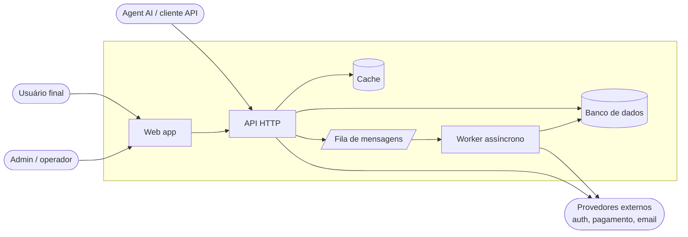
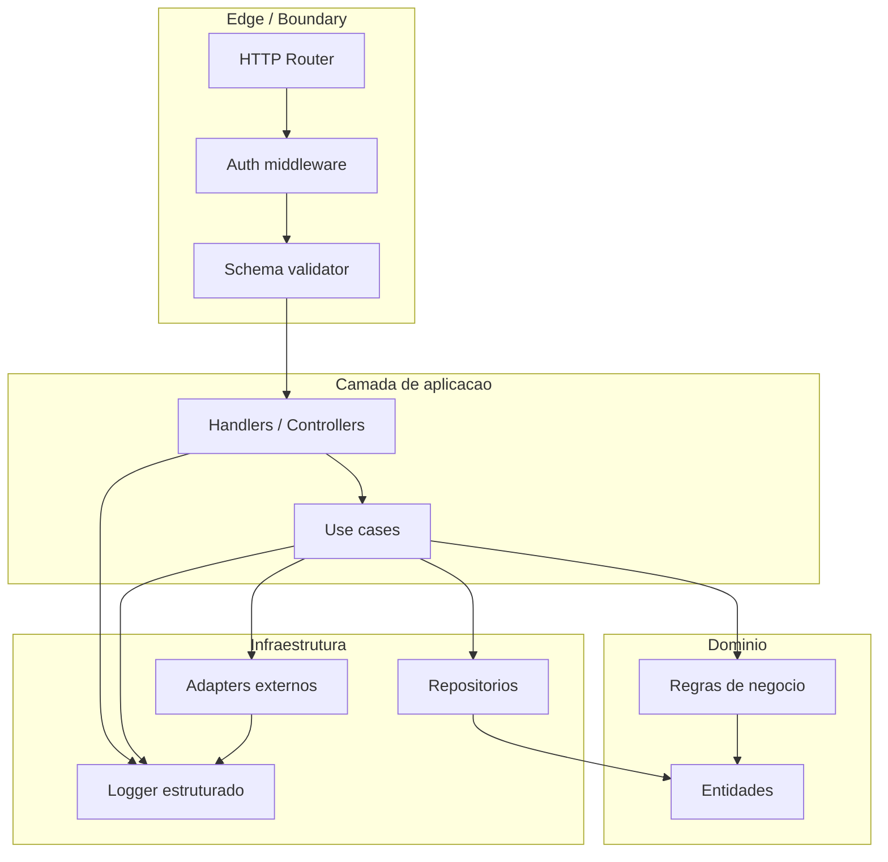

# Design — `<PRODUCT_NAME>`

> Visão geral da arquitetura. Documento vivo. Decisões pontuais ficam em ADRs (`./ADR-*.md`).
> Audiência: devs novos no projeto, agents AI, revisores externos.

---

## 1. Contexto de sistema

Visão de alto nível: quem fala com quem.

Notas:
- `web` é cliente burro: chama `api`. Sem lógica de domínio.
- `api` é o único caminho de escrita no `db`.
- `worker` consome `queue` para tarefas longas (envio de email, processamento batch, sync com terceiros).
- Provedores externos sempre via adapter — nunca cliente HTTP solto no domínio.

---

## 2. Componentes (zoom)

Detalhe interno do `<PRODUCT_NAME>`:

Princípio: dependências apontam para dentro. Domínio não conhece infra.

---

## 3. Boundaries

| Boundary | Responsabilidade | Regra |
|----------|------------------|-------|
| Edge | Receber request, validar shape, autenticar | Rejeita cedo. Não chama domínio com input cru. |
| App (use case) | Orquestrar passos, transação, eventos | Stateless. Recebe input já validado. |
| Domain | Regras invariantes, entidades, value objects | Sem IO. Sem framework. Testável puro. |
| Infra | Persistência, terceiros, logging | Implementa interfaces que o domínio define. |

Cruzar boundary errado = code smell. Repositório chamando handler é vermelho.

---

## 4. Stack

> Placeholder: substituir conforme `<STACK>` real do projeto.

| Camada | Tecnologia |
|--------|------------|
| Linguagem | `<STACK>` |
| Framework HTTP | `<STACK>` |
| Banco | `<STACK>` (relacional / documento / KV) |
| Cache | `<STACK>` |
| Fila | `<STACK>` |
| Testes | unit, integration, e2e (Playwright) |
| CI | GitHub Actions (`.github/workflows/ci.yml`) |
| Observabilidade | logs estruturados + métricas + traces |

Mudou stack? Abrir ADR. Não trocar silencioso.

---

## 5. Decisões principais

Decisões arquiteturais relevantes ficam em ADRs versionados. Resumo:

- [ADR-001](./ADR-001-example.md) — Adotar trunk-based development.
- [ADR-002](./ADR-002-example.md) — `<placeholder próxima decisão>`.

Toda decisão que afeta mais de um componente ou trava reversibilidade vira ADR. Detalhe e processo: ver `ADR-template.md`.

---

## 6. Fluxo de uma request típica

1. Cliente bate em `api/v1/<recurso>`.
2. Router casa rota e middleware de auth valida token.
3. Validator checa schema (rejeita 400 se inválido).
4. Handler chama use case com DTO já tipado.
5. Use case carrega entidades via repositório.
6. Domínio executa regra (pode levantar erro de negócio).
7. Use case persiste mudança e enfileira eventos.
8. Handler serializa resposta.
9. Logger registra evento estruturado (sem PII).

Falhou no passo 3? Retorna sem tocar domínio. Falhou no 6? Retorna 422 com código de erro de domínio.

---

## 7. Não-objetivos

- Não suportar multi-tenant antes de validar single-tenant.
- Não escalar prematuramente: monolito modular antes de microserviços enquanto time `<TEAM>` for pequeno.
- Não acoplar UI a regras de domínio.
- Não duplicar tipos entre `web` e `api`: contrato compartilhado.

---

## 8. Observabilidade

- Logs estruturados em JSON, com `trace_id` propagado entre serviços.
- Níveis: `error`, `warn`, `info`, `debug`. Padrão prod = `info`.
- Métricas RED (rate, errors, duration) por endpoint.
- Tracing distribuído cobrindo edge, use case, infra.
- PII nunca em log. Ver `PATTERNS.md` seção logging.

---

## 9. Como evoluir este documento

- Mudança pequena (corrigir typo, atualizar diagrama existente): PR direto.
- Mudança estrutural (novo componente, novo boundary): abrir ADR, depois atualizar `DESIGN.md`.
- Renomear conceito: atualizar glossário em `.specs/product/DOMAIN.md` no mesmo PR.
- Domínio `<DOMAIN>` específico: documentar invariantes em `DOMAIN.md`, não aqui.
