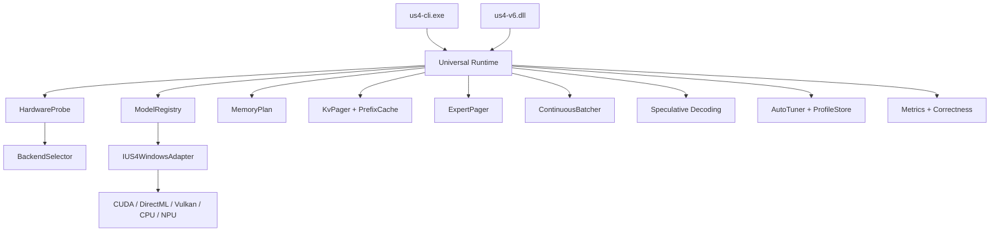

# Domain — US4 V6 Windows Edition

## Glossário

- **Universal Runtime** — núcleo comum que orquestra CLI/SDK, seleção de backend, scheduler, adapters e telemetria.
- **Adapter** — módulo que adapta uma família de modelos ao contrato do runtime, definindo capacidades, `KVLayout`, `QuantStrategy` e `MemoryPlan`.
- **Backend** — implementação de execução concreta: CUDA, DirectML, Vulkan, oneDNN/CPU AVX ou Windows ML/NPU.
- **HardwareProbe** — subsistema que detecta CPU features, RAM, GPU vendor, VRAM, suporte a CUDA, D3D12, Vulkan e NPU.
- **BackendSelector** — política que escolhe backend primário, ordem de fallback e `RuntimeMode`.
- **RuntimeMode** — perfil global de operação: `FULL`, `BALANCED`, `DEGRADED`, `ULTRA_LOW`, `MICRO`, `NANO`, `CPU_ONLY`.
- **PowerThermalMonitor** — subsistema do core que consolida sinais de ETW e `GetSystemPowerStatus` para disparar downgrade térmico/energético observável.
- **MemoryPlan** — plano de alocação e tiering entre VRAM hot, RAM warm e SSD cold.
- **KV Cache** — armazenamento de keys/values de attention usado por prefill e decode.
- **KV Pager** — mecanismo de promoção, demotion, compressão e flush do KV entre VRAM, RAM e SSD.
- **Prefix Cache** — cache de prefill reutilizável entre prompts compatíveis.
- **Expert Pager** — mecanismo de paginação para experts de modelos MoE, com hot/warm/cold tiers.
- **Continuous Batching** — scheduler multi-sessão que compartilha janelas compatíveis sem corromper KV.
- **Speculative Decoding** — caminho opcional de draft + verify para reduzir latência sem mudar a saída final.
- **Correctness Diff** — comparação de logits/saída contra referência estável para provar que otimização não degradou correctness.
- **Profile Store** — persistência de perfis de hardware e autotune por máquina.

## Entidades principais

- `RuntimeContext`
- `UniversalRuntime`
- `HardwareProfile`
- `RuntimePreferences`
- `BackendPlan`
- `IUS4WindowsAdapter`
- `Tensor` / `TensorView`
- `KvPager`
- `PrefixCache`
- `ExpertPager`
- `ContinuousBatcher`
- `AutoTuner`
- `TelemetrySnapshot`

## Diagrama

## Invariantes

- O adapter não escolhe hardware; ele responde ao hardware escolhido.
- Toda otimização relevante pode ser desligada para comparação com baseline.
- KV promovido ou restaurado mantém equivalência de logits dentro da tolerância da task.
- `RuntimeMode` só degrada automaticamente; promoção exige nova seleção/reinicialização controlada.
- Downgrade automático pode ser disparado por pressão térmica/energética sustentada; promoção automática não acontece no mesmo ciclo.
- O fallback de backend não pode corromper sessão nem trocar silenciosamente a semântica do modelo.
- NPU offload é sempre opt-in e nunca requisito para funcionamento básico.

## Estados de runtime

- `idle`
- `probing`
- `loading`
- `ready`
- `prefill`
- `generating`
- `degraded`
- `error`

## Termos vetados

- `GPU` sem qualificar caminho concreto quando isso importar para a análise.
- `auto` sem dizer se é `backend auto`, `mode auto` ou `autotune`.
- `fast` sem benchmark.
- `supported` sem dizer em qual backend e em qual modo.
