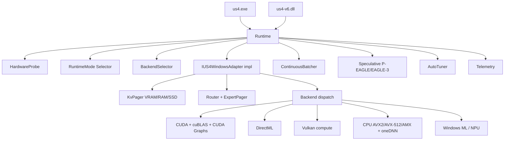

# Domain — US4 V6 Windows Edition

## Glossario
- **Adapter** — modulo que adapta um family LLM (Qwen, Llama, DeepSeek MoE, etc.) a interface `IUS4WindowsAdapter`.
- **Backend** — pilha computacional: CPU scalar / AVX2 / AVX-512 / AMX / oneDNN / CUDA / DirectML / Vulkan / Windows ML (NPU).
- **Runtime Mode** — perfil global: FULL / BALANCED / DEGRADED / ULTRA_LOW / MICRO / NANO / CPU_ONLY.
- **Hardware Profile** — combinacao especifica de GPU/CPU/RAM/VRAM (8 perfis canonicos).
- **KV Cache** — store de key/value de attention.
- **Hot-Cold KV Tiering** — VRAM hot, RAM warm, SSD cold (mmap), summary (compressed).
- **MoE / Expert Pager / SP-MoE** — vide Apple Edition (mesma semantica).
- **Speculative Decoding / P-EAGLE / EAGLE-3** — vide Apple Edition.
- **NPU** — Neural Processing Unit em laptops modernos (Snapdragon X, Intel Core Ultra, AMD Ryzen AI), acessivel via Windows ML.
- **AMX** — Intel Advanced Matrix eXtensions (BF16/INT8) em Sapphire Rapids+.
- **CUDA Graphs** — grafos pre-capturados que reduzem overhead de launch.
- **DirectML** — API de inferencia ML cross-vendor sobre D3D12.
- **Vulkan compute** — backend portavel cross-vendor para shaders compute.
- **Correctness Diff** — vide Apple Edition.

## Entidades
- `IUS4WindowsAdapter`, `RuntimeMode`, `HardwareProbe`, `BackendSelector`.
- `KvPager` / `PrefixCache` / `Summarizer` (tier VRAM/RAM/SSD).
- `Router` / `ExpertPager` / `SpeculativePrefetch`.
- `ContinuousBatcher` / `SessionPool`.
- `AutoTuner` / `Profile`.
- `Telemetry`.

## Diagrama

## Invariantes
- `IUS4WindowsAdapter::generate()` deterministico para `(seed, temperature=0)`.
- KV evictado pro SSD restaura identico.
- Speculative produz tokens identicos a non-speculative.
- Mode transitions monotonicas (so degrada, nunca volta sem reset).
- Backend selecionado nunca quebra correctness diff alem da tolerancia.
- NPU offload sempre opt-in; fallback transparente quando ausente.

## Estados de runtime
- `idle` / `loading` / `ready` / `generating` / `degraded` / `error` (mesma semantica Apple).

## Termos vetados
- "GPU" sem qualificar vendor (use "CUDA path" / "DirectML path" / "Vulkan path").
- "Auto" sem qualificar (mode? backend? tile size?).
- "Fast" sem numero.
