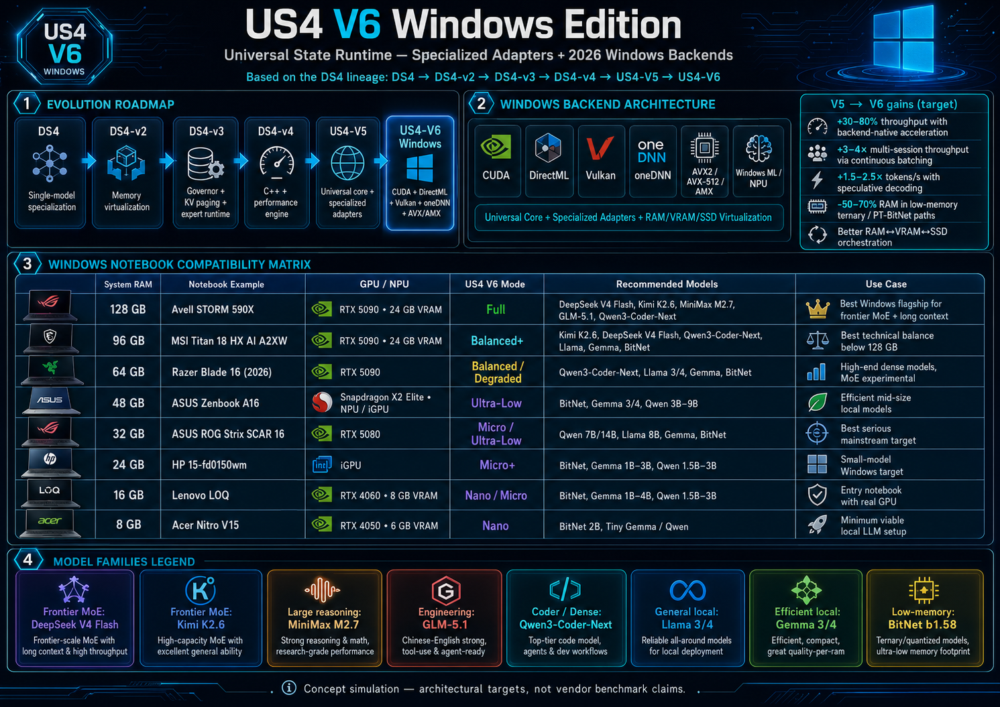

# US4 V6 - Windows Edition

> Universal State Runtime para inferencia local de LLMs em Windows x86-64 (NVIDIA / AMD / Intel + NPU opcional).
> pt-BR. EN version: [README.md](README.md).



## O que e

US4 V6 e um runtime C++ para inferencia local de LLMs em Windows x86-64 com dispatch adaptativo entre CPU, CUDA, DirectML, Vulkan e caminhos opcionais via Windows ML / NPU. O repositorio ja saiu do estado de planejamento puro: ele tem uma superficie real de CLI, selecao de backend orientada a hardware, baseline CPU scalar, scaffolds de benchmark/tuning por matriz e documentacao de produto e arquitetura suficiente para sustentar os sprints restantes.

Spec master de referencia: [`US4-V6-Windows-Edition.md`](./US4-V6-Windows-Edition.md).

## Status Atual

A base atual ja inclui:

- scaffold do runtime Windows em CMake dentro de [`runtime/`](./runtime/)
- deteccao de capacidades do host e selecao de backend para CUDA, DirectML, Vulkan, Windows ML e fallback CPU
- comandos `help`, `version`, `probe`, `run`, `bench` e `tune` no `us4-cli`
- caminho funcional CPU scalar para `run --backend cpu`
- dry-run planners para CUDA, DirectML, Vulkan e Windows ML
- um `MatrixRunner` que alimenta `bench` e o mini-bench persistente de `tune`
- profile store persistente por host em `runtime/tuning/profiles.json`, com override por `US4_PROFILE_STORE_PATH`
- cobertura unitaria, E2E Playwright de CLI, gates de correctness e documentacao em [`.specs/`](./.specs/)

Na pratica, o repo esta em fase forte de implementacao: os contratos de CLI e planner ja sao reais, enquanto execucao device-side mais profunda, packaging e fechamento de release seguem evoluindo sprint a sprint.

## Superficie Atual Da CLI

O contrato atual de `us4-cli` e:

```text
us4-cli help
us4-cli version
us4-cli probe [--format <text|json>]
us4-cli serve --model <model-id> [--format <text|json>] [--backend <auto|cpu|cuda|directml|vulkan|windows-ml|npu>] [--mode <auto|full|balanced|degraded|ultra_low|micro|nano|cpu_only>] [--npu]
us4-cli run --model <model-id> --prompt <text> [--model-path <asset>] [--format <text|json>] [--max-tokens <count>] [--backend <auto|cpu|cuda|directml|vulkan|windows-ml|npu>] [--mode <auto|full|balanced|degraded|ultra_low|micro|nano|cpu_only>] [--npu]
us4-cli bench --model <model-id> [--format <text|json>] [--max-tokens <count>] [--backend <auto|cpu|cuda|directml|vulkan|windows-ml|npu>] [--mode <auto|full|balanced|degraded|ultra_low|micro|nano|cpu_only>] [--npu]
us4-cli tune --model <model-id> [--format <text|json>] [--max-tokens <count>] [--backend <auto|cpu|cuda|directml|vulkan|windows-ml|npu>] [--mode <auto|full|balanced|degraded|ultra_low|micro|nano|cpu_only>] [--npu]
```

Comportamento atual:

- `probe` imprime o resumo do hardware/backend, inclui uma previa sintetica de telemetria MoE com contadores de cold offload/reload e tambem aceita `--format json`.
- `serve` imprime o scaffold de serving para o host atual e aceita `--format text|json`.
- `run` executa o baseline CPU scalar quando o plano resolve para CPU-only, imprime planos dry-run para os backends nao CPU e agora tambem aceita `--format json`.
- `bench` avalia a matriz atual de benchmarks sem persistir perfil. Ele aceita `--format text` e `--format json`.
- `tune` executa o mini-bench planner, escolhe o melhor profile para o fingerprint atual do host, persiste essa selecao no profile store e agora tambem aceita `--format json`.
- `version` agora vem da versao do projeto no CMake gerada no build, embora os metadados de release ainda nao estejam fechados ponta a ponta.

Ainda nao implementado:

- publicacao de MSIX assinado ainda nao esta fechada, mas o repo agora ja inclui scaffold de winget e smoke local de pos-publicacao para o zip portatil.

## Bench E Tune Por Matriz

`bench` e `tune` sao suportados pelo `MatrixRunner` em [`runtime/benchmarks/`](./runtime/benchmarks/):

- `bench` constroi a matriz atual de benchmark para a combinacao pedida de modelo/backend/mode e exporta o conjunto de samples pontuados.
- `tune` reutiliza esse fluxo, escolhe o melhor profile suportado para o host atual e persiste a selecao.
- o profile persistido e indexado por um hardware fingerprint derivado de CPU, GPU, NPU e budgets de memoria/storage.

Local esperado do store:

- padrao: `runtime/tuning/profiles.json`
- override: `US4_PROFILE_STORE_PATH=<caminho-absoluto-ou-relativo>`

Exemplos:

```powershell
.\build\us4-cli.exe bench --model qwen-0.5b --backend cpu --mode cpu-only
.\build\us4-cli.exe bench --model qwen-0.5b --backend cpu --mode cpu-only --format json
.\build\us4-cli.exe tune --model qwen-0.5b --backend windows-ml --npu
```

## Stack

- C++17/20 + CMake + Ninja
- CUDA
- DirectML
- Vulkan compute
- oneDNN / AVX2 / AVX-512 / AMX
- Windows ML para caminhos opcionais de NPU
- GoogleTest para cobertura unitaria
- Playwright para evidencia E2E de CLI/UX
- GitHub Actions para gates de CI / DoD

## Setup Local

Setup recomendado em Windows:

1. Instale o Visual Studio 2022 com MSVC e ferramentas de build C++.
2. Garanta CMake e Ninja disponiveis, normalmente via ambiente de desenvolvimento do Visual Studio.
3. Abra um Developer PowerShell / VS Dev shell.
4. Configure e compile:

```powershell
cmake -S . -B build -G Ninja -DCMAKE_BUILD_TYPE=Release
cmake --build build -j
```

5. Exercite a CLI:

```powershell
.\build\us4-cli.exe probe
.\build\us4-cli.exe run --model qwen-0.5b --prompt "hi" --backend cpu
.\build\us4-cli.exe run --model qwen-0.5b --prompt "hi" --backend cpu --format json
.\build\us4-cli.exe bench --model qwen-0.5b --backend cpu --mode cpu-only --format json
.\build\us4-cli.exe tune --model qwen-0.5b --backend cpu --mode cpu-only
```

6. Rode a validacao:

```powershell
ctest --test-dir build --output-on-failure
npx playwright test --project=cli
```

Se o foco for apenas a camada do starter/documentacao, [`scripts/test.ps1`](./scripts/test.ps1) continua validando separadamente a parte de bootstrap/packaging.

Setup de completions no PowerShell:

```powershell
.\scripts\install-completions.ps1
```

Helpers de artefato de release:

```powershell
.\scripts\build-portable-zip.ps1 -BuildDir build -OutputDir dist
.\scripts\generate-checksums.ps1 -OutputDir dist
.\scripts\post-publish-smoke.ps1 -ArtifactPath .\dist\us4-v6-windows-0.1.50-portable.zip
.\scripts\release-dry-run.ps1 -BuildDir build -OutputDir dist -ManifestDir .\packaging\winget\manifests -Format json
.\scripts\render-project-status.ps1 -BuildDir build -RequireEvidence -Format markdown -OutputPath .\dist\project-status.md
.\scripts\render-winget-manifests.ps1 -Version 0.1.50
.\scripts\validate-winget-manifests.ps1 -ManifestDir .\packaging\winget\manifests
.\scripts\validate-release-assets.ps1 -OutputDir .\dist -ManifestDir .\packaging\winget\manifests
.\scripts\validate-publish-layout.ps1 -OutputDir .\dist
.\scripts\render-release-manifest.ps1 -OutputDir .\dist -ManifestDir .\packaging\winget\manifests
.\scripts\render-release-notes.ps1 -Version 0.1.50 -ReleaseManifestPath .\dist\release-manifest.json
.\scripts\render-planning-status.ps1 -Format markdown -OutputPath .\.specs\sprints\STATUS.md
.\scripts\create-dev-signing-cert.ps1 -CertificatePassword us4-dev-pass -Format json
.\scripts\dev-msix-smoke.ps1 -BuildDir build -CertificatePassword us4-dev-pass -Format json
.\scripts\post-publish-smoke.ps1 -ArtifactPath .\dist\us4-v6-windows-0.1.50.0.msix -EnableDevMsixSmoke -DevCertificatePassword us4-dev-pass
.\scripts\sign-msix.ps1 -PackagePath .\dist\us4-v6-windows-0.1.50.0.msix
.\scripts\preflight-release.ps1 -BuildDir build
.\scripts\install-msix-smoke.ps1 -PackagePath .\dist\us4-v6-windows-0.1.50.0.msix
```

`release-dry-run.ps1` e `render-project-status.ps1` agora usam manifests efêmeros por padrão para não sujar `packaging/winget/manifests/` no fluxo local. Passe `-ManifestDir .\packaging\winget\manifests` apenas quando quiser renderizar manifests mantidos no repo.

`dev-msix-smoke.ps1` é um caminho local apenas para desenvolvimento. Ele reduz o gap de MSIX exercitando packaging autoassinado em um único host, mas não substitui o requisito de certificado confiável para release pública.

`post-publish-smoke.ps1 -EnableDevMsixSmoke` adiciona um smoke local dev-only para `.msix` a partir do artefato final, mas continua nao substituindo a exigencia de certificado confiavel e host real para a release publica.

## Layout Do Repo

```text
.specs/                 Documentacao de produto, arquitetura, workflow e sprints
runtime/
  core/                 Probe, planejamento de runtime e execucao CPU scalar
  backends/             Deteccao de capacidades, selecao de backend e dry-run planners
  adapters/             Contratos de adapters e scaffolds de model loader
  memory/ kv/ cache/    Modulos de memoria e paginacao
  moe/ speculative/     Scaffolds de MoE e decoding
  tuning/               AutoTuner e profile store persistente por host
  telemetry/            Scaffolds de observabilidade
  benchmarks/           MatrixRunner, correctness gates e benchmark registry
profiles/               Presets de perfil de hardware/runtime
tests/unit/             Cobertura com GoogleTest
tests/e2e/              Evidencia Playwright de CLI
```

## Como Trabalhar Aqui

Este repo segue o contrato de [`AGENTS.md`](./AGENTS.md). As instrucoes canonicas para agentes ficam em [`AGENTS.md`](./AGENTS.md) e sao espelhadas em [`CLAUDE.md`](./CLAUDE.md) e [`.github/copilot-instructions.md`](./.github/copilot-instructions.md).

Para trabalho tecnico, o loop esperado continua sendo: ler a task, carregar o contexto arquitetural, editar de forma cirurgica, rodar format/lint/unit, executar Playwright em mudancas de CLI, reexecutar correctness e regressao nos backends tocados e anexar evidencia no PR.

Se a mudanca tocar:

- `bench`, inclua a saida da matriz usada na validacao, especialmente `--format json` quando o contrato JSON mudar.
- `tune`, inclua evidencia da CLI e o `profiles.json` persistido usado na validacao.
- release ou packaging, atualize [`.specs/workflow/RELEASE.md`](./.specs/workflow/RELEASE.md) no mesmo change.

Notas de migracao para a baseline atual de CLI/release estao em [`docs/migration-guide.md`](./docs/migration-guide.md).

## Proximos Marcos

Os maiores marcos restantes agora sao:

- aprofundar a execucao device-side alem do dry-run em Vulkan e Windows ML
- fechar a superficie de CLI/release da Sprint 12, incluindo paridade de JSON e packaging
- fechar assinatura de MSIX com certificado no CI e validacao em host real para artefatos publicados
- alinhar versao canonica do runtime, changelog e metadados de release ponta a ponta

## Fora De Escopo

- Inferencia em nuvem ou distribuida
- Treino ou fine-tuning
- Suporte Linux/macOS nesta edicao
- Aplicacao desktop GUI no lugar do foco em CLI/runtime

## Licenca

A politica de licenciamento ainda nao foi publicada. Trate o repositorio como interno/controlado pelo projeto ate a definicao da primeira politica de release publica.
