# Skills Tutorial — Vídeo Remotion

Vídeo explicativo (1080p · 30fps · ~59s) sobre **como usar as skills** do `agentic-starter`. Construído com [Remotion](https://www.remotion.dev/) — vídeo programático em React. Mesma timeline em **dois idiomas** (pt-BR e en) via `<LangProvider>` + dicionário em `src/i18n.ts`.

| Idioma | Vídeo | Capa | Stills | Composition ID |
|---|---|---|---|---|
| 🇧🇷 pt-BR | [`assets/skills-tutorial.mp4`](./assets/skills-tutorial.mp4) | [`assets/cover.png`](./assets/cover.png) | [`evidence/`](./evidence) | `SkillsTutorialPT` |
| 🇺🇸 English | [`assets/skills-tutorial-en.mp4`](./assets/skills-tutorial-en.mp4) | [`assets/cover-en.png`](./assets/cover-en.png) | [`evidence-en/`](./evidence-en) | `SkillsTutorialEN` |

[](./assets/skills-tutorial.mp4)

<details>
<summary>Players embarcados (clique para expandir)</summary>

**pt-BR:**

<video src="./assets/skills-tutorial.mp4" controls width="100%"></video>

**English:**

<video src="./assets/skills-tutorial-en.mp4" controls width="100%"></video>

</details>

---

## Índice das cenas

| #  | Cena                  | Duração | Conteúdo                                                       |
|----|-----------------------|---------|----------------------------------------------------------------|
| 01 | `Intro`               | 5,0 s   | Logo orbital, título e badges das ferramentas suportadas       |
| 02 | `WhatAreSkills`       | 6,0 s   | Definição de skill + anatomia do `SKILL.md`                    |
| 03 | `Catalog`             | 6,0 s   | As 3 skills inclusas no starter                                |
| 04 | `PlaywrightSkill`     | 8,0 s   | Trigger, hard rule de evidência, código de exemplo             |
| 05 | `CommitsSkill`        | 8,0 s   | Anatomia da mensagem, tipos, breaking change                   |
| 06 | `HowToInvoke`         | 7,0 s   | Trigger explícito vs. implícito (com terminais animados)       |
| 07 | `CreateYourOwn`       | 7,0 s   | Passo-a-passo para criar uma skill nova com `_template`        |
| 08 | `BestPractices`       | 6,0 s   | 6 dicas + lista do que **não** virar skill                     |
| 09 | `Outro`               | 6,0 s   | Recap em pílulas + CTA                                         |

Total: **59 s** (1.770 frames). A capa estática (`npm run still`) é renderizada do frame **110** — momento em que o título e o subtítulo já estão totalmente visíveis.

---

## Galeria — todas as cenas em imagens

Cada PNG abaixo é o frame **estabilizado** da cena (capturado por `npm run regression`, mesmas imagens versionadas em [`evidence/`](./evidence) e [`evidence-en/`](./evidence-en)). Útil pra revisar o conteúdo sem rodar o vídeo.

### 01 · Intro
| 🇧🇷 pt-BR | 🇺🇸 English |
|---|---|
| 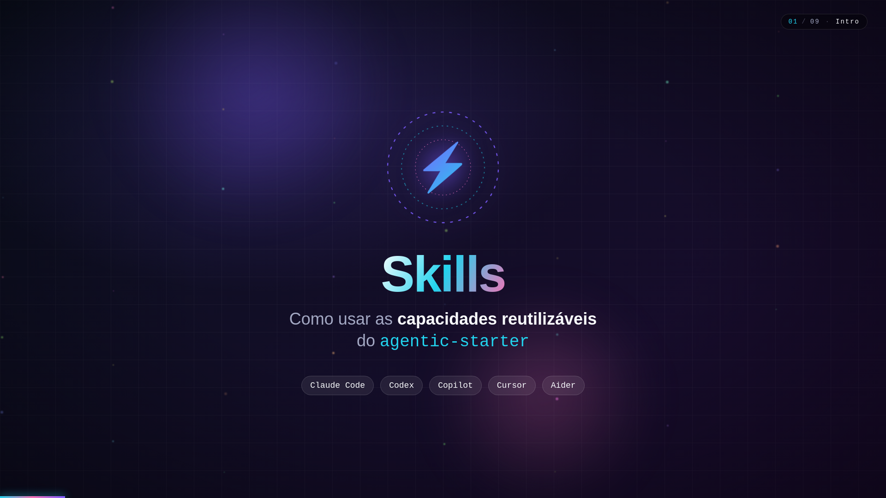 | 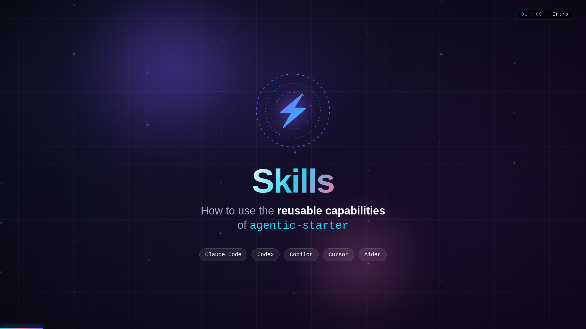 |

### 02 · O que é uma skill? · What is a skill?
| 🇧🇷 | 🇺🇸 |
|---|---|
|  | 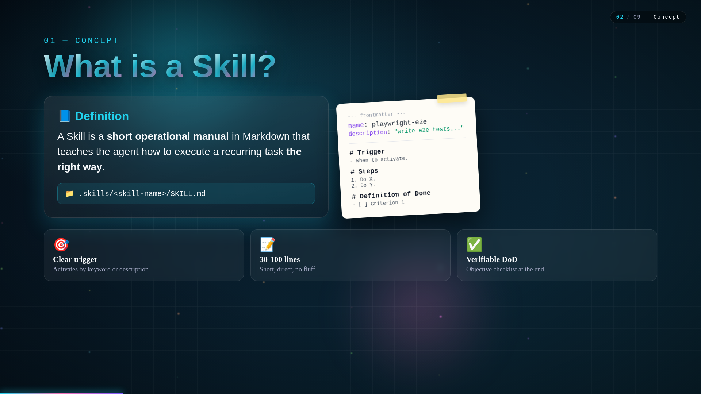 |

### 03 · Catálogo · Catalog
| 🇧🇷 | 🇺🇸 |
|---|---|
| 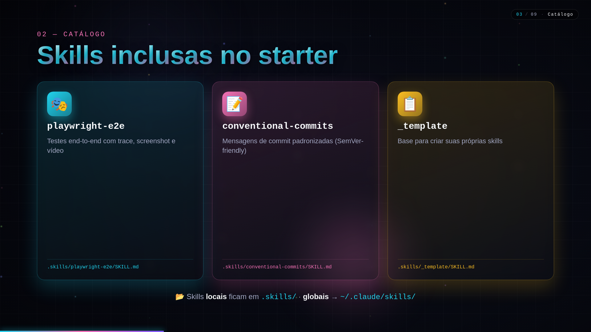 | 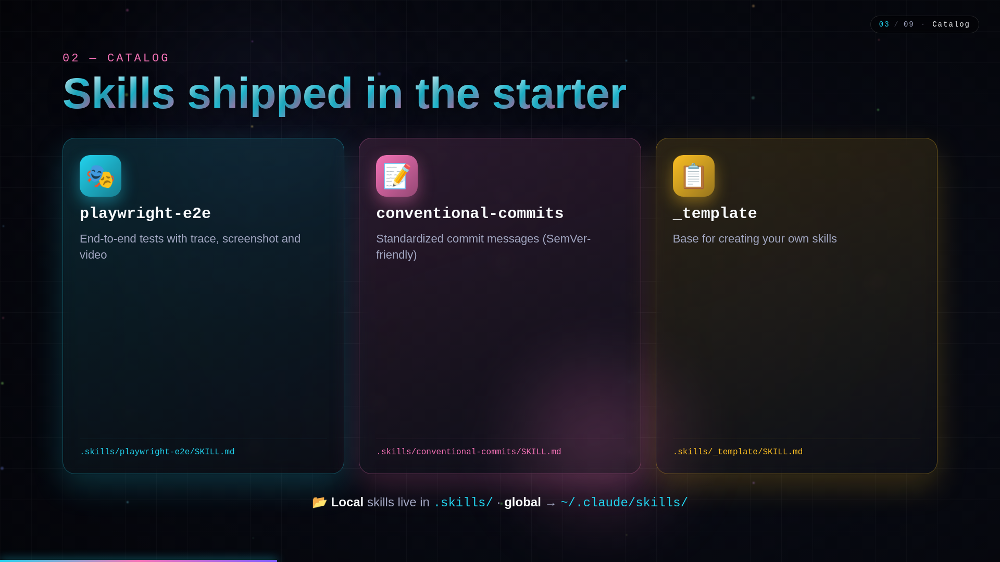 |

### 04 · Skill `playwright-e2e`
| 🇧🇷 | 🇺🇸 |
|---|---|
| 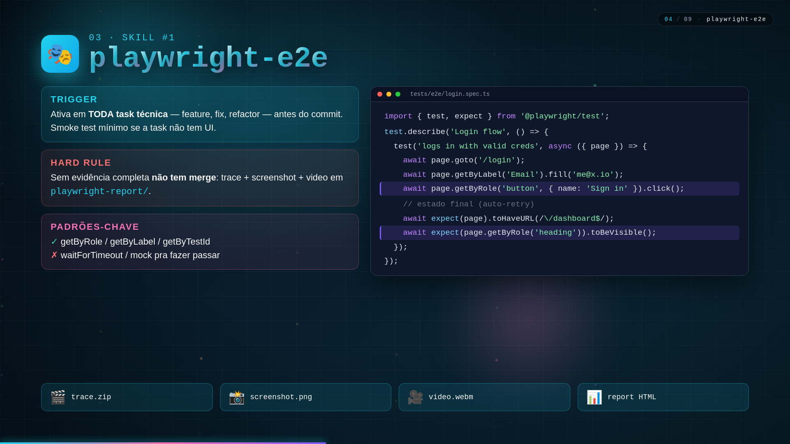 | 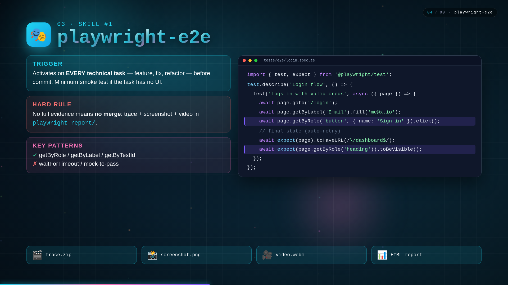 |

### 05 · Skill `conventional-commits`
| 🇧🇷 | 🇺🇸 |
|---|---|
|  | 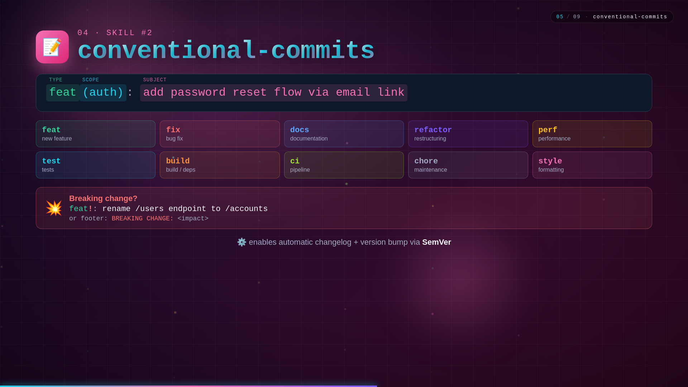 |

### 06 · Como invocar · How to invoke
| 🇧🇷 | 🇺🇸 |
|---|---|
| 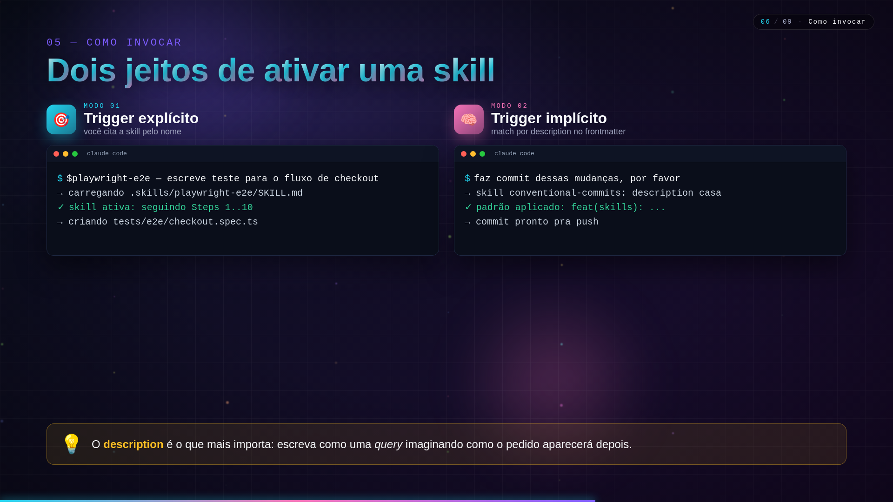 | 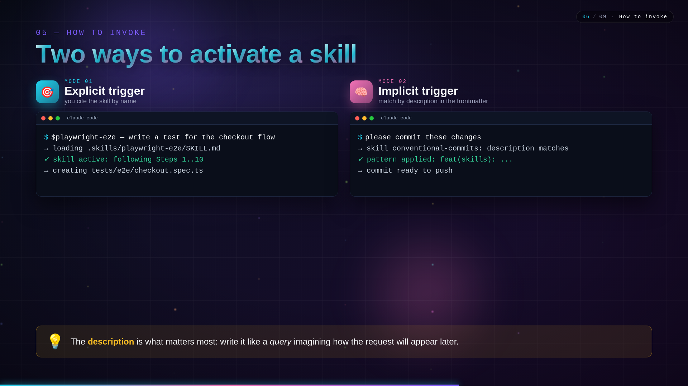 |

### 07 · Crie a sua · Build your own
| 🇧🇷 | 🇺🇸 |
|---|---|
| 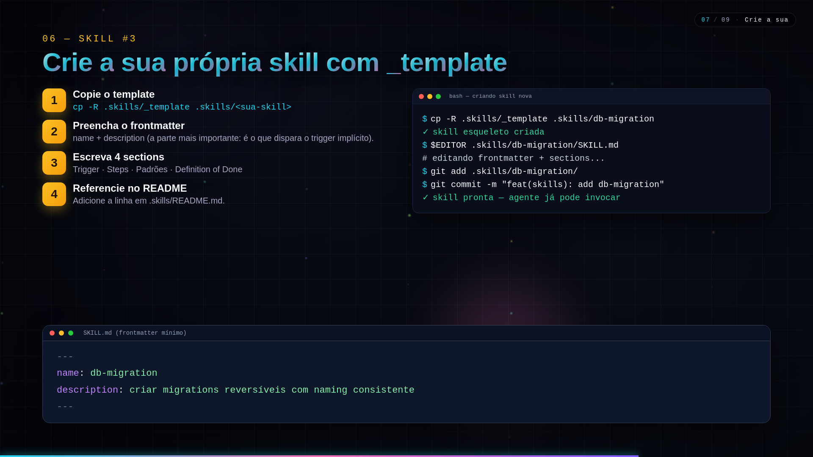 | 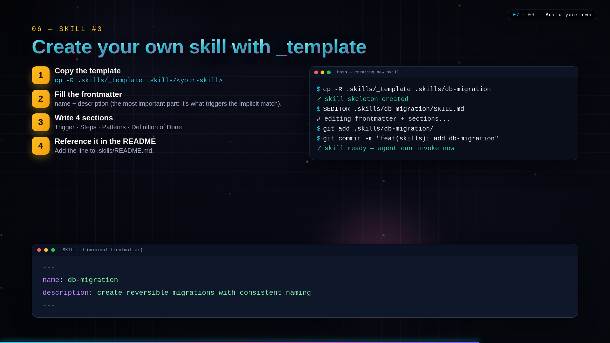 |

### 08 · Boas práticas · Best practices
| 🇧🇷 | 🇺🇸 |
|---|---|
|  | 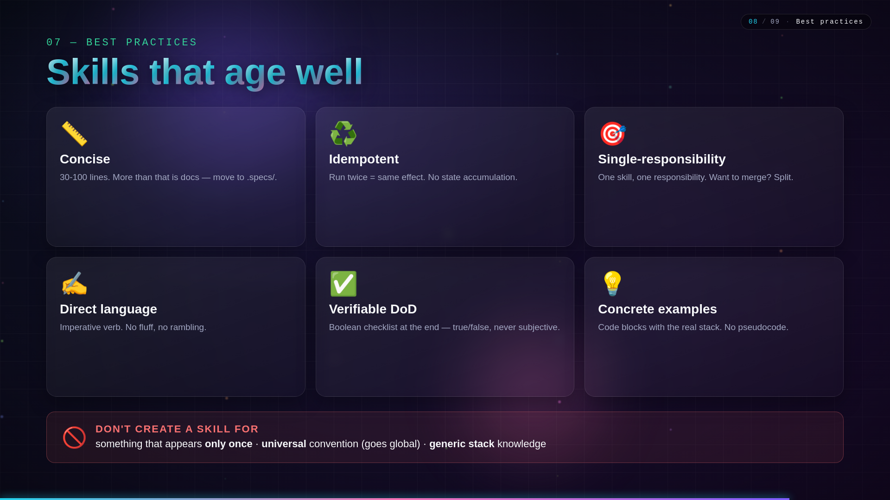 |

### 09 · Outro
| 🇧🇷 | 🇺🇸 |
|---|---|
|  | 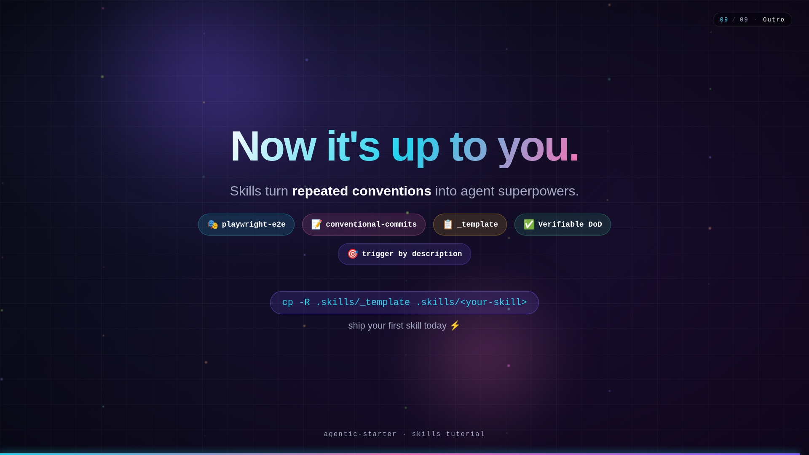 |

---

## Comandos

```bash
# Studio interativo (preview com hot reload em http://localhost:3000)
npm start

# Render do MP4 em pt-BR (default)
npm run build

# Render do MP4 em English
npm run build:en

# Render dos dois (pt + en, sequencial)
npm run build:all

# Capas estáticas (frame 110)
npm run still           # pt-BR -> assets/cover.png
npm run still:en        # English -> assets/cover-en.png

# Teste de regressão visual: 18 stills (9 cenas × 2 idiomas, frames estabilizados)
npm run regression
```

Saídas versionadas em `assets/` e `evidence/` / `evidence-en/`. A pasta `out/` fica como rascunho local.

---

## Regressão visual

`npm run regression` faz **bundle único + render de 9 stills** (~7 segundos no total) — um para cada cena, no frame em que todas as animações de entrada já estabilizaram. As evidências ficam em `evidence/<NN>-<scene>-frame-<F>.png` e estão versionadas (~13 MB total) como prova-de-vida do pipeline.

| # | Cena | Frame settled | Verifica |
|---|---|---|---|
| 01 | Intro | 130 | logo orbital, título, badges |
| 02 | WhatAreSkills | 310 | card definição + paper SKILL.md + pills |
| 03 | Catalog | 490 | 3 cards (playwright/commits/_template) |
| 04 | PlaywrightSkill | 730 | code block + evidence row |
| 05 | CommitsSkill | 970 | anatomia, 10 chips, breaking change |
| 06 | HowToInvoke | 1180 | 2 terminais com typing completo |
| 07 | CreateYourOwn | 1390 | 4 steps + terminal + frontmatter |
| 08 | BestPractices | 1570 | 6 cards + warning box |
| 09 | Outro | 1750 | recap pills + CTA |

O script falha (exit 1) se qualquer PNG ficar abaixo de 30 KB (sinal de cena em branco). Revisão visual humana ainda é necessária para alterações que mudem layout/cor.

---

## Estrutura

```
video/
├── src/
│   ├── index.ts              # entry point (registerRoot)
│   ├── Root.tsx              # registra a Composition
│   ├── SkillsTutorial.tsx    # sequência das cenas + progress bar + label
│   ├── theme.ts              # paleta + fontes
│   ├── components/
│   │   ├── AnimatedText.tsx  # texto com reveal por caractere
│   │   ├── BackgroundFX.tsx  # gradiente + grid + orbs + partículas
│   │   ├── Bullet.tsx        # item de lista com ícone
│   │   ├── Card.tsx          # cartão glassmorphism animado
│   │   ├── CodeBlock.tsx     # bloco de código com tokens coloridos
│   │   ├── SceneTransition.tsx  # fade-in/out + scale entre cenas
│   │   └── Terminal.tsx      # mock de terminal com typing effect
│   └── scenes/
│       ├── Intro.tsx
│       ├── WhatAreSkills.tsx
│       ├── Catalog.tsx
│       ├── PlaywrightSkill.tsx
│       ├── CommitsSkill.tsx
│       ├── HowToInvoke.tsx
│       ├── CreateYourOwn.tsx
│       ├── BestPractices.tsx
│       └── Outro.tsx
├── package.json
├── remotion.config.ts
└── tsconfig.json
```

---

## Como editar

- **Texto / cor** → ajuste em `src/theme.ts` ou direto no JSX da cena.
- **Duração** → array `SCENES` em `src/SkillsTutorial.tsx` (em frames; 30fps).
- **Nova cena** → crie `src/scenes/MinhaCena.tsx`, importe em `SkillsTutorial.tsx` e adicione no array.

> Roda `npm start` e edita ao vivo: o studio re-renderiza a cada save.

---

## Notas

- Primeira execução baixa o **Chrome Headless Shell** (~88 MB) — só uma vez.
- Render usa `@remotion/compositor-linux-x64-gnu` (ffmpeg + libavcodec inclusos no pacote).
- Sem dependências de mídia externa: todo o vídeo é gerado por código (CSS/SVG/animações).
